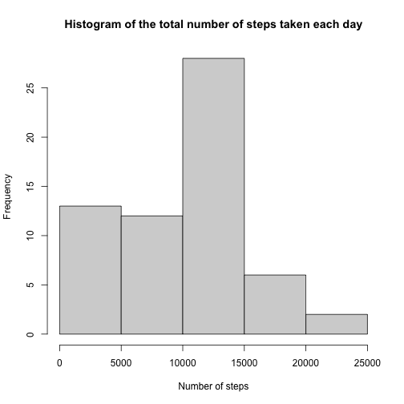
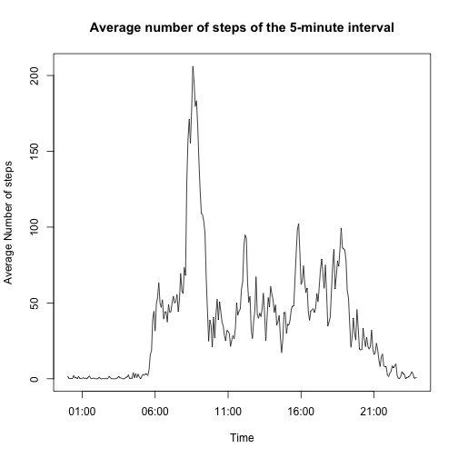
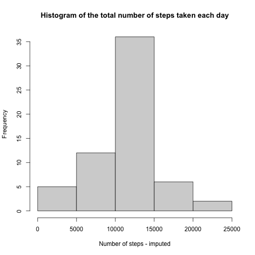
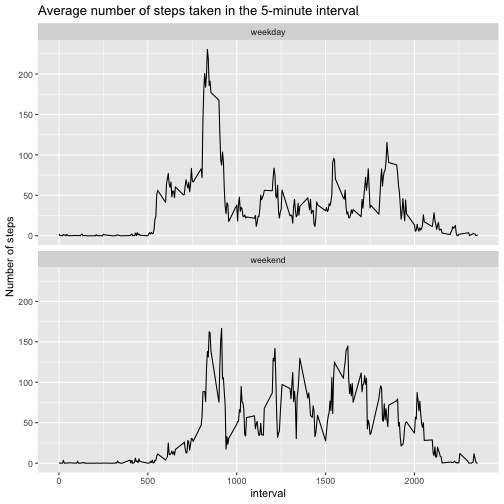

## Loading and preprocessing the data
Show any code that is needed to

1. Load the data (i.e. read.csv())

2. Process/transform the data (if necessary) into a format suitable for your analysis


```r
library(tidyverse)
library(lubridate)

if (!file.exists("data")) {
        dir.create("data")
}

# Preparing the data. If the selected data already exists, 
# then it is retrieved in from the working directory. 
# Otherwise, it is downloaded.

if (file.exists("./data/activity.csv")) {
        cat("Retrieving data file")
        activity <- read.csv("./data/activity.csv")
} else {
        cat("No valid data file found in the local directory. Downloading from the original zip file on the internet. \n")
        fileUrl <- "https://d396qusza40orc.cloudfront.net/repdata%2Fdata%2Factivity.zip"
        download.file(fileUrl, destfile = "./data/activity.zip")
        unzip("./data/activity.zip", exdir = "./data")
        file.remove("./data/activity.zip")
        activity <- read.csv("./data/activity.csv")
} 
```

```
## Retrieving data file
```

```r
# Pre-processing the data
activity$interval <- formatC(activity$interval, width = 4, flag = "0")
activity$hour <- substr(activity$interval, 1,2)
activity$minute <- substr(activity$interval, 3,4)
activity$time <- paste(activity$hour, activity$minute, sep = ":")
activity$datetime <- paste(activity$date, activity$time)
activity$datetime <- ymd_hm(activity$datetime)
```

## What is mean total number of steps taken per day?
For this part of the assignment, you can ignore the missing values in the dataset.

1. Make a histogram of the total number of steps taken each day

2. Calculate and report the **mean** and **median** total number of steps taken per day


```r
# 1. Make a histogram
df1 <- group_by(activity, date) %>%
        summarise(n.steps = sum(steps, na.rm = TRUE))
hist(df1$n.steps, 
     main = "Histogram of the total number of steps taken each day",
     xlab = "Number of steps")
```



```r
# 2. Calculate and report the mean and median 
mean(df1$n.steps, na.rm = TRUE)
```

```
## [1] 9354.23
```

```r
median(df1$n.steps, na.rm = TRUE)
```

```
## [1] 10395
```

## What is the average daily activity pattern?
1. Make a time series plot (i.e. type = "l") of the 5-minute interval (x-axis) and the average number of steps taken, averaged across all days (y-axis)

2. Which 5-minute interval, on average across all the days in the dataset, contains the maximum number of steps?


```r
# 1. Make a time series plot
df2 <- group_by(activity, interval) %>%
        summarise(mean.steps = mean(steps, na.rm =TRUE))
df2$today <- ymd_hm(paste(as.character(today()), df2$interval))
plot(df2$today, df2$mean.steps, type = "l",
     main = "Average number of steps of the 5-minute interval",
     xlab = "Time",
     ylab = "Average Number of steps")
```



```r
# 2. Identify the interval which contains the maximum number of steps
df2$interval[which.max(df2$mean.steps)]
```

```
## [1] "0835"
```

## Imputing missing values
Note that there are a number of days/intervals where there are missing values (coded as NA). The presence of missing days may introduce bias into some calculations or summaries of the data.

1. Calculate and report the total number of missing values in the dataset (i.e. the total number of rows with NAs)

2. Devise a strategy for filling in all of the missing values in the dataset. The strategy does not need to be sophisticated. For example, you could use the mean/median for that day, or the mean for that 5-minute interval, etc.

3. Create a new dataset that is equal to the original dataset but with the missing data filled in.

4. Make a histogram of the total number of steps taken each day and Calculate and report the mean and median total number of steps taken per day. Do these values differ from the estimates from the first part of the assignment? What is the impact of imputing missing data on the estimates of the total daily number of steps?  


```r
# 1. Total number of missing values in the dataset
apply(is.na(activity), 2, sum)
```

```
##    steps     date interval     hour   minute     time datetime 
##     2304        0        0        0        0        0        0
```

```r
# 2. The mean for that 5-minute interval is filled in the missing values
df3 <- left_join(activity, df2, by = "interval")
df3 <- mutate(df3, steps = ifelse(is.na(steps), df3$mean.steps, steps))

# 3. Create a new dataset with the missing data filled in
df4 <- group_by(df3, date) %>%
        summarise(n.steps = sum(steps))

# 4. Make a histogram and calculate and report the mean and median
hist(df4$n.steps, 
     main = "Histogram of the total number of steps taken each day",
     xlab = "Number of steps - imputed")
```



```r
mean(df4$n.steps)
```

```
## [1] 10766.19
```

```r
median(df4$n.steps)
```

```
## [1] 10766.19
```

Imputing the missing values make the peak of the histogram higher while it make the left tail lower. As a result, mean and median get higher than those in the first part of the assignment.

## Are there differences in activity patterns between weekdays and weekends?
For this part the weekdays() function may be of some help here. Use the dataset with the filled-in missing values for this part.

1. Create a new factor variable in the dataset with two levels -- "weekday" and "weekend" indicating whether a given date is a weekday or weekend day.

2. Make a panel plot containing a time series plot (i.e. type = "l") of the 5-minute interval (x-axis) and the average number of steps taken, averaged across all weekday days or weekend days (y-axis).


```r
# 1. Create a new factor variable
df5 <- mutate(df3, flag = wday(as.Date(date))) %>%
        mutate(flag = ifelse(flag %in% c(1,7), "weekend", "weekday")) %>%
        mutate(flag = as.factor(flag)) %>%
        mutate(interval = as.integer(interval))

# Make a panel plot
library(ggplot2)
df6 <- group_by(df5, interval, flag) %>%
        summarise(mean.steps = mean(steps))
```

```
## `summarise()` has grouped output by 'interval'. You can override using the `.groups` argument.
```

```r
g <- ggplot(df6, aes(x = interval, y = mean.steps))
g + geom_line() + facet_wrap(. ~ flag, nrow = 2, ncol = 1) +
        labs(title = "Average number of steps taken in the 5-minute interval") +
        labs(y = "Number of steps")
```



The plot shows that average number of steps tend to be higher in the morning (8:00-9:00) on weekdays compared to weekends. However, the activity of weekends look higher than that of weekdays during the daytime (9:00 - 17:00).
